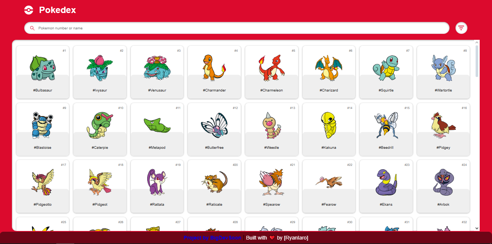
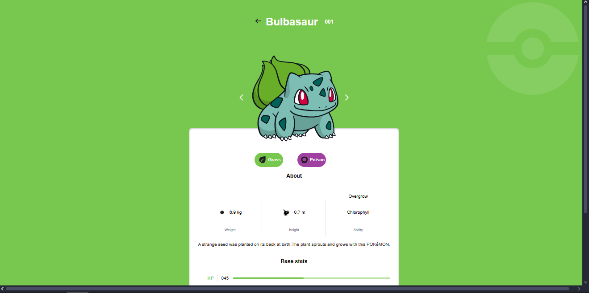

# Pokedex Project

## 📌 Description
This is a project from BigDevSoon consisting of a Pokedex using [PokéAPI](pokeapi.co), a free open-source RESTful api.

It's a project I picked up and wrote in HTML, CSS & JavaScript for practice purposes to strengthen my fundamentals in JavaScript and DOM manipulation.

## 🛠️ Tech Stack
- HTML
- CSS
- JavaScript (Vanilla)
- PokéAPI

## ✨ Features
- Fetch Pokémon data from an API (gen 1)
- Filter Pokémon by number or by name
- Display Pokémon details dynamically
- Responsive layout
- No frameworks or libraries used

## 🚀 Getting Started
1. Clone the repository:
```bash
git clone https://github.com/RyanIaro/Pokedex-project.git
```
2. Open **index.html** in your browser

## 📸 Screenshots
- Home page


- Details page
